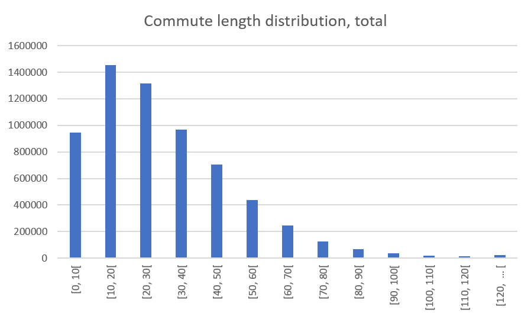
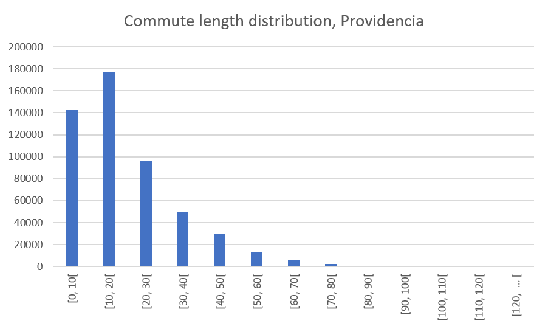
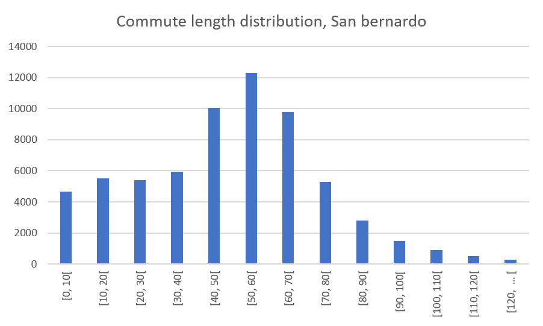

# 2020-transantiago-trips
Analysis of trips in transantiago with Apache Pig and Hadoop. [Joaquín Diaz, Valentina Ramos, José Luis Romero. Grupo 7]

# Overview

<!-- State what is the main goal of the project. State what sorts of question(s) you want to answer or what sort of system you want to build. (Questions may be non-technical -- e.g., is there a global correlation between coffee consumption and research output -- so long as they require data analysis or other technical solutions.) -->

<!-- Esto es temporal, la idea es cambiarlo despues según que consultas hagamos -->
The goal of the project is to gather insights from the Transantiago trip data. We would like to answer questions like: Which buses are the most packed? At what time do people start their commute to work in each borough? How long on average are trips starting from each borough? Where are most jobs concentrated?

# Data

<!-- Describe the raw dataset that you considered for your project. Where did it come from? Why was it chosen? What information does it contain? What format was it in? What size was it? How many lines/records? Provide links. -->

We're using the trip data from [this dataset](http://www.dtpm.cl/index.php/documentos/matrices-de-viaje) in the DTPM (Departamento de Transporte Público Metropolitano) website, the public transport department for the Metropolitan Region in Chile. We chose this dataset because we would like to know how people use this conveyance, and because its a good start point to use for the future, to compare (when there is data aviable) how the usage has changed after the social outburst and the coronavirus pandemic.

The dataset contains information of individual trips in transantiago, each compressed file contains the data of a week, separated in weekdays and weekend. The data for each week is about 24 million rows long, structured in a single table with about 100 columns in csv format using semicolons as separators. Uncompressed the data for each week is about 10GB in size. Given the space constraints of sharing a cluster with many groups we will be working only with the data from a single week.

To process the data we first uncompressed and then recompressed the data in a format that works well with MapReduce and uploaded it to the distributed file system, we then created a script for loading the data, specifying the type for each of the columns, ignoring the headers, converting '-' to nulls, and loading dates with the correct format string. 

# Methods

<!-- Detail the methods used during the project. Provide an overview of the techniques/technologies used, why you used them and how you used them. Refer to the source-code delivered with the project. Describe any problems you encountered. -->

The main technologies used were Apache Hadoop and Apache Pig. These technologies were chosen, because they allow processing large ammounts of data relatively easily. The data was loaded on the Hadoop Distributed File System and then was processed using various Apache Pig scripts.

As was previously mentioned we creatd a Pig script for loading the data which we used as a base for the other scrips, we then created a different Pig script for each group of queries we wanted to do, which then were concatenated with the script for loading the data using a bash script.

After the queries were run, the getmerge command was used to obtain the combination of parts generated by MapReduce for each result. These files were then stored in the results directory in the repository.

When we wanted to study commutes we filtered trips that listed work as their purpose, since the dataset we're using is obtained from Bip validations, we assume that this field is an approximation made by the DTPM.

At first we separated morning from evening commutes by having a start time earlier then 12 a.m. However, with these method we found the  average end time of trips to be extremely early, so we decided to further filter morning commutes and evening commutes using a range of six hours for each one, ranging from 5 a.m. to 9 a.m. for morning commutes, and from 4 p.m. to 8 p.m. for evening commutes.

Since we were not sure if the range we had decided was reasonable, we also calculated the distribution of start and end times in intervals of 10 minutes.

We also wanted to focus on the municipalities with the longest commute length times, so for the five municipalities with the longest commutes we plotted their top destinations.

# Results

<!-- Detail the results of the project. Different projects will have different types of results; e.g., run-times or result sizes, evaluation of the methods you're comparing, the interface of the system you've built, and/or some of the results of the data analysis you conducted. -->

We mainly studied the start time of morning commutes, the end time of evening commutes and the length of commutes, for every municipality in the city of Santiago.

In the following graph you can observe the average length of commutes for every municipality, obtained using the method described above.

The next two graphs show the average morning commute start time, and the average evening commute end time, for every municipality.

In this graph the distribution of length of commutes for all municipalities can be seen. And in the following graphs the same distribution can be seen, but for the municipalities with the shortest and longest average length of commutes, Providencia and San Bernardo.

This map shows the most common destinations for morning commutes starting in La Pintana.

# Conclusion

<!-- Summarise main lessons learnt. What was easy? What was difficult? What could have been done better or more efficiently? -->

The data backed up our previous idea that lower income municipalities have longer commutes. Also, the difference between the municipality with the longest commutes and the shortest commutes being more almost one hour was surprising. 

- There exists a great difference in the length of commutes of poeple who reside in the municipalities of Providencia, Ñuñoa, Santiago and Las Condes. Trips departing in the morning from this municipalities or arriving in the evening to these municipalities are considerably shorter in time than those that can be attributed to residents of other municipalities. This could be related to the fact that most of the jobs in Santiago are concentrated in these municipalities ([CEPCHILE, 2019](https://www.cepchile.cl/cep/site/artic/20180405/asocfile/20180405120239/dpp_029_abril2018_srazmilic.pdf)), so the residents of these municipalities are more likely to live near their workplace, resulting in their commutes being shorter. 

<!-- - Existe una gran diferencia en los tiempos de translado hacia el lugar de trabajo de las personas que residen en las comunas de Providencia, Ñuñoa, Santiago y Las Condes, siendo estos tiempos mucho menores a los del resto de las comunas. Se llega a la conclusión de que en estas comunas se concentra la mayor cantidad de lugares de trabajo de Santiago, por lo que si una persona reside en estas comunas, lo más probable es que también trabaje dentro de estas y su traslado sea menor. Esto coincide con los datos de un estudio realizado con CEPCHILE el 2019 (https://www.cepchile.cl/cep/site/artic/20180405/asocfile/20180405120239/dpp_029_abril2018_srazmilic.pdf) -->

- There's a great number of people who live in the municipalities far from the city center, whose commutes are considrably longer. This factor is directly related to the land-value in these areas. According to studies from CEPCHILE, the lowest land-value is concentrated in the municipalities near the peripheria, which has resulted in massive building of social housing far from the places where the biggest supply of jobs is concentrated.

<!-- - Existe una gran cantidad de personas que residen en comunas periféricas, las cuales registran un mayor tiempo de traslado hacia sus lugares de trabajo. Este factor tiene relación directa con el valor de suelo de estas comunas. Según estudios de CEPCHILE, el menor valor de suelo se encuentra en las comunas más alejadas del centro de Santiago, lo que ha provocado una masiva construcción de viviendas sociales alejadas de los lugares donde se concentra la mayor oferta laboral. -->

- According to the same source, the most likely jobs for people living in the above mentioned municipalitues coorrespond to:
	- Construction workers
	- Domestic workers
	- Laundry workers
	- Messengers, guards and simialar

<!-- - Los trabajos más probables de las personas que residen en las comunas mencionadas en el punto anterior corresponden a:

	- Oficiales y operarios de la construcción
	- Personal que realiza labores domésticas y afines.
	- Personal que trabaja en lavanderías y tintorerías.
	- Mensajeros, porteros y afines. -->

Peple who do these jobs coincide with people who live in municipalities with a high Social Priority Index (http://www.desarrollosocialyfamilia.gob.cl/storage/docs/INDICE._DE_PRIORIDAD_SOCIAL_2019.pdf).

<!-- Personas que realizan estos trabajos coinciden con las personas que residen en comunas con mayor índice de prioridad social (http://www.desarrollosocialyfamilia.gob.cl/storage/docs/INDICE._DE_PRIORIDAD_SOCIAL_2019.pdf) -->

- It can be concluded that the peoplo who spend the most time commuting coincide with the people with lower incomes and thus, higher social priority index, which can be explained by not having enough resources to afford living in the places where most jobs aare concentrated or near them.

<!-- - Se puede concluir con todo lo mencionado anteriormente, que las personas que invierten más tiempo trasldándose a sus trabajos, coincide con las personas que suelen tener menores ingresos y por lo tanto mayor índice de prioridad social. Esto por no tener los recursos suficientes para residir en una comuna con alta concentración de oferta laboral o en una cercana a estas. -->

In terms of the project what was hardest was to understand all the fields in the data and to interpret if the results we were obtaining were reasonable or a mistake. What was easy was to work with Apache Pig, since it's similar to using SQL. If had had more time we could've done more and more diverse queries and made more visualizations of our results.

<!-- # Appendix -->

<!-- You can use this for key code snippets that you don't want to clutter the main text. -->
